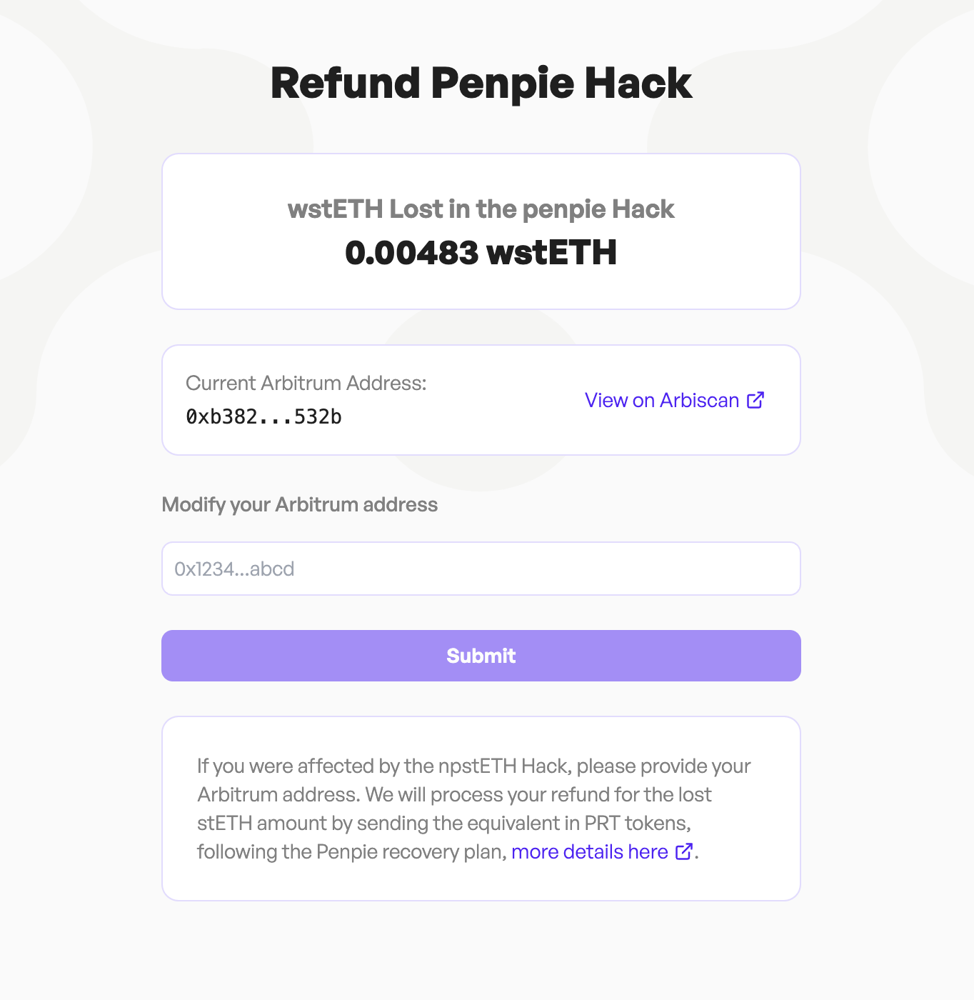
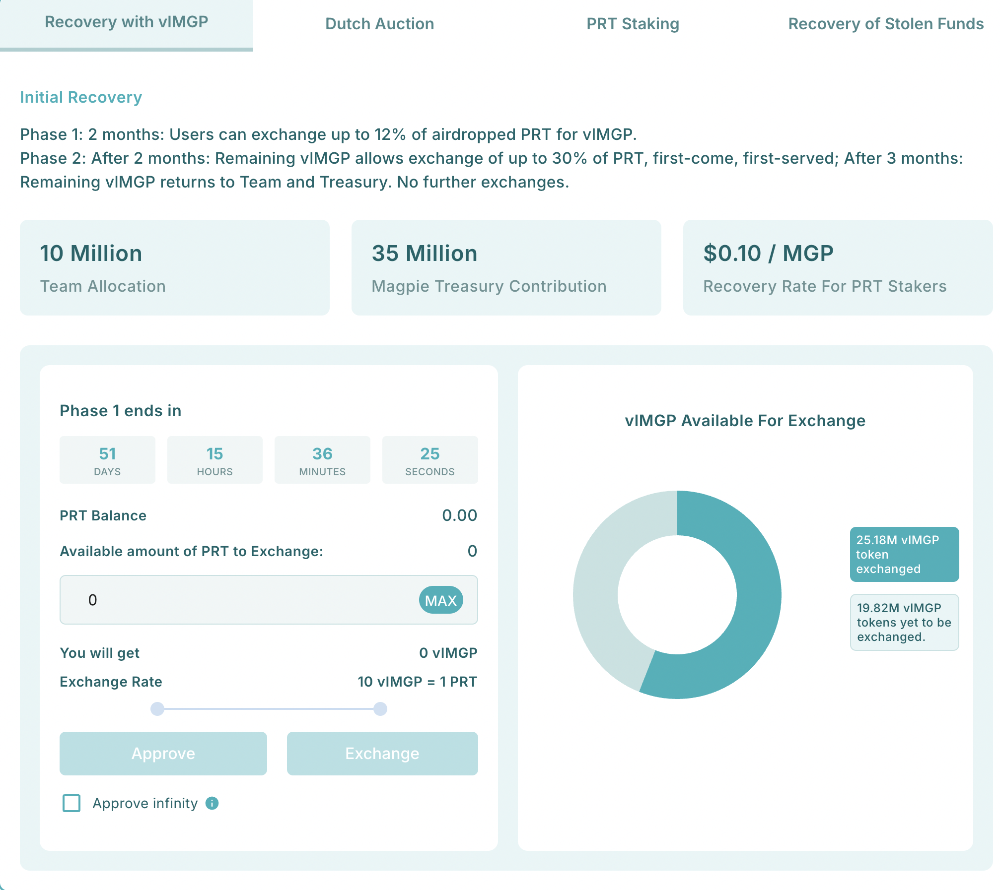
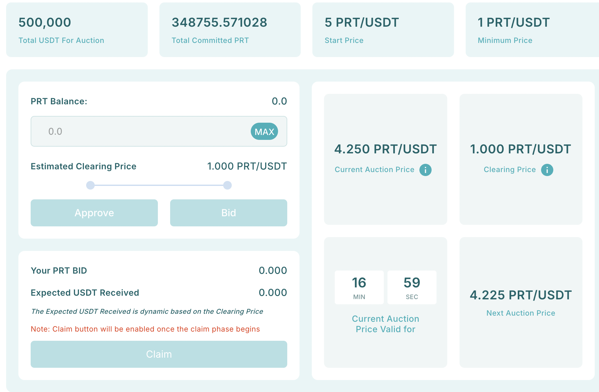

This page outlines everything you need to know about the Penpie recovery plan, including how to claim your PRT tokens and what you can do with them once received. We'll cover process of adding the address to receive PRT tokens and your options for utilizing PRT tokens.

You can review the list of eligible users in this [spreadsheet](https://docs.google.com/spreadsheets/d/12UmRi3Oan2jrqFjBWYcj9OjYgwAYzxwQHG68FGE7fVQ/edit?gid=1081129999#gid=1081129999). The document includes detailed balance information for all affected addresses.

## Get Started

Visit [app.nimbora.io/refund](http://app.nimbora.io/refund) and connect your wallet. 

You will be prompted to add your Arbitrum address.

 PRT will be sent to the address you submit.

**Notes**: 

- You can modify your Arbitrum address at any time before PRT distribution.
- PRT tokens will be distributed on a weekly basis.

# What can you do with PRT?

Visit https://www.pendle.magpiexyz.io/recovery  and connect the wallet address you received PRT on.  Switch to Arbitrum.

You will be met with a few options: 

## 1# Exchange PRT for vlMGP

This mechanism allows affected users to recover funds by exchanging PRT tokens for vlMGP on Penpie at a fixed rate of 0.10 PRT per vlMGP. Up to 45 million MGP tokens will be claimable by PRT holders in the form of vlMGP. As users [exchange PRT for vlMGP](https://www.pendle.magpiexyz.io/recovery), the total PRT supply will decrease, ensuring a balanced and structured process. Notably, PRT exchanged for vlMGP will be burned, representing the reduction of a portion of the debt.

## Key Points of the Recovery Mechanism

### Funding Sources

- 10 million MGP (1% of total supply) from the Team’s allocation.
- 35 million MGP (3.5% of total supply) from the Magpie Treasury.

Note: These funds are distributed as vlMGP. For every 10 vlMGP distributed, 1 PRT is removed from circulation.

### Recovery Process

- Exchanging PRT: PRT holders will have the opportunity to exchange PRT for vlMGP at a fixed rate of 0.10 PRT per vlMGP via Penpie’s Recovery Page.

### Timeline

1. First Two Months:

- Users can exchange up to 12% of their airdropped PRT for vlMGP at $0.10 per token.

2. Post Two Months:

- The remaining vlMGP can be exchanged for up to 30% of users’ airdropped PRT on a first-come, first-served basis.

3. After Three Months:

- Unused vlMGP will be returned to the Team and Treasury.
- No further exchanges of PRT for vlMGP will be possible.

### Action Required

Users are encouraged to participate within the specified timelines to maximize recovery benefits.

## 2# PRT Dutch Auction

The PRT Dutch Auction is a dynamic event where users can use their Penpie Recovery Tokens (PRT) to bid for USDT. The auction begins with a starting price, which decreases steadily over time until all USDT is sold at clearing price or the event concludes.

Penpie has allocated $500,000 USDT for this [Dutch Auction](https://www.pendle.magpiexyz.io/recovery), offering significant funds to users. To ensure fairness, all participants receive the same clearing price for USDT, fostering an equitable recovery process. Additionally, the auction’s transparent structure eliminates speculation and price manipulation, providing a secure and predictable environment for all participants.

### Dutch Auction Explained

1. Starting Price: The highest price at which the auction begins. It sets the ceiling for the auction, ensuring no bids are higher than this amount. This is the initial price and represents the maximum someone is willing to pay if the auction closed immediately.

2. Minimum Price: The lowest price that the auction can reach, ensuring there’s a minimum value for the asset. This is the bottom limit for pricing, the auction won’t go lower than this.

3. Auction Price: The current price of the asset during the auction, which decreases over time from the starting price toward the minimum price. It represents the real-time price at which bidders can participate. This is the live price you see during the auction — it drops as time passes. The auction price is not the price at which users will make their purchase. Instead, it is more like the price users are willing to purchase at.

4. Clearing Price: The final price at which all participants purchase their tokens. This price is determined based on the ratio of total PRT tokens to total USDTs. The auction ends when the clearing price meets the auction price.

### PRT Dutch Auction Mechanism

- The auction begins with a starting price of 1 USDT received for every 5 PRT spent.
- Over time, the price decreases linearly and participants can decide when to bid.
- Participants bid using PRT tokens to acquire USDT.
- The auction concludes when the clearing price meets the auction price.
- At the conclusion, all participants receive the same clearing price for USDT, calculated based on total bids and the amount of USDT available.

### Auction Details

- Total USDT Allocation: $500,000
- Starting Price: Each USDT is biddable at a price of 5 PRT
- Minimum Price: Each USDT is biddable at a price of 1 PRT
- Price Reduction: Linear decrease (0.025 PRT / USDT drop per hour)

### For Example

At the auction start, the price is set at 5 PRT per USDT. Participants bid by committing their PRT, and the final clearing price is determined at the end of the auction.

1. First Bid:

A participant places a bid of 50,000 PRT. At this moment, the tentative clearing price is adjusted based on the total PRT contributed and the total USDT available.

If no other bids are made, this participant would tentatively receive 50,000 USDT as the clearing price is still minimum price. However, USDT is not distributed immediately. Instead, the bid influences the clearing price as more participants join.

2. More Bid Coming :

As the auction progresses, the auctionprice decreases to 4 PRT per USDT, encouraging further participation.

More participants place bid and now there is total of 650K PRT commited, the tentative clearing price is recalculated based on the cumulative PRT contributed and the total available USDT. So at this moment, the tentative clearing price becomes 1.3 PRT per USDT. And auction still continue because clearing price (1.3 PRT / USDT) has not reached auction price (4 PRT / USDT)

3. Further Bids and Final Clearing Price:

Suppose more participants bid, bringing the total PRT contributed to 1,200,000 PRT and makes the clearing price meet auction price.

Now auction ends and clearing price is finalized as 2.4 PRT / USDT (1,200,000 total commited PRT / 500,000 total USDT for bid)

4. Final Allocation:

At this final clearing price, all participants receive USDT based on their PRT contributions proportionally.

- One participant’s 50,000 PRT would entitle him to 20,833 USDT (50,000 ÷ 2.4)
- Another participant’s 140,000 PRT would entitle him to 58,333 USDT (140,000 ÷ 2.4)

### Note:

- The clearing price ensures fairness as all participants receive USDT at the same rate, irrespective of when they bid. Earlier bids only influence the dynamics of price discovery but do not determine individual rates of exchange.
- Once users place a PRT bid, they cannot withdraw it.

### Why Participate in the Dutch Auction?

The [PRT Dutch Auction](https://www.pendle.magpiexyz.io/recovery) allows users to recover USDT in a fair and efficient manner:

- Equitable Pricing: All participants receive the same clearing price.
- Transparent Mechanism: No room for speculation or manipulation.
- Immediate Recovery: Bid using PRT and claim USDT after the auction concludes.

With $500,000 USDT allocated for the auction, Penpie is taking a significant step toward helping affected users recover their losses.

### Important Information for Participants

- Auction Start: January 5, 2025
- Duration: Scheduled to run for up to 160 hours, but it could conclude earlier if the clearing price meets or exceeds the auction price.
- How to Participate: Place bids using PRT through the Penpie dApp.
- Settlement: Once the auction ends, participants will be able to claim their USDT based on the final clearing price.

## 3# PRT Staking

## 4# Recovery of stolen funds

If the stolen funds are recovered, they will be sent to the recovery contract. Affected users who have staked their PRT tokens in the recovery contract will receive their portion of the recovered assets proportional to the staked PRT. Once all PRT tokens have been fully removed from circulation, any additional recovered funds will be allocated to the Penpie treasury.

ETH Recovery: If ETH is recovered, the recovery amount will be calculated based on the price of ETH at the time of the exploit. For example, if the price of ETH at the time of the exploit was $2400, then for every recovered ETH sent to the recovery contract, 2400 PRT will be removed. This ensures a fair and accurate distribution of recovered assets.Example: If you hold 1% of the distribution of recovered assets.Example: If you hold 1% of the total PRT supply and 5000 ETH is recovered, you would receive 50 ETH. A total of 120,000 of your PRT removed in exchange for your ETH. A total of 120,000 of your PRT removed in exchange for your recovered amounts.

Stablecoin Recovery: If stablecoins are recovered, recovered amounts will be handled on a 1:1 basis. For every $1 in stablecoins recovered and distributed, 1 PRT will be removed from the recovery contract.
### Stay Tuned for Upgrades

Keep an eye on our updates as we roll out new features and advanced strategies to enhance your earning potential.

Join our [Discord](http://discord.gg/nimbora) for alpha and early notifications 🚀

 

# About Nimbora

Nimbora is a Starknet-based omnichain 1-click yield strategies platform that enables users to engage with Layer 1 protocols at a fraction of the cost. Discover the best of Ethereum protocols and optimize your DeFi strategies with Nimbora.

🐧🌐 [Website](https://www.nimbora.io/)

🐧👨‍💻 [DApp](https://app.nimbora.io/)

🐧🐦 [Twitter](https://twitter.com/Nimbora_)

🐧👋 [Discord](http://discord.gg/nimbora)

🐧💼 [LinkedIn](https://www.linkedin.com/company/nimbora/)

🐧📖 [Medium](https://medium.com/@Nimbora)

🐧🗞️ [Docs](https://docs.nimbora.io/)

🐧🛡 [Yield Dex Audit](https://github.com/0xSpaceShard/nimbora_audit_report_yield_dex/blob/main/Nimbora%20Audit%20Report.pdf)

🐧🛡 [LST Audit](https://github.com/0xSpaceShard/nimbora-lst-public-audit/blob/main/Nimbora%20-%20Zellic%20Audit%20Report.pdf)