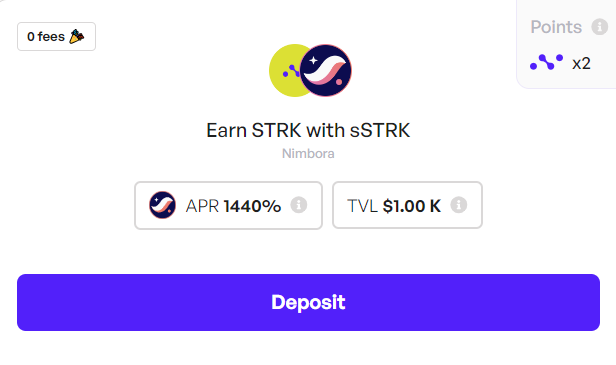
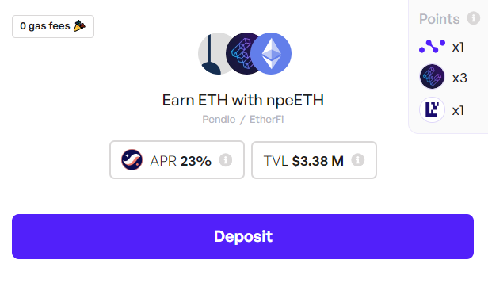
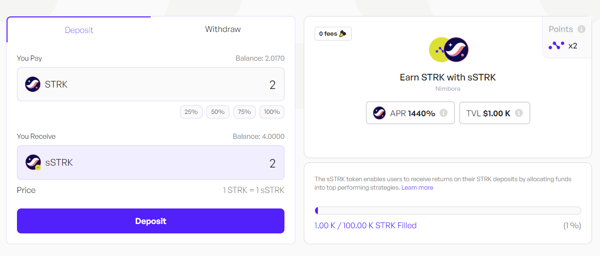
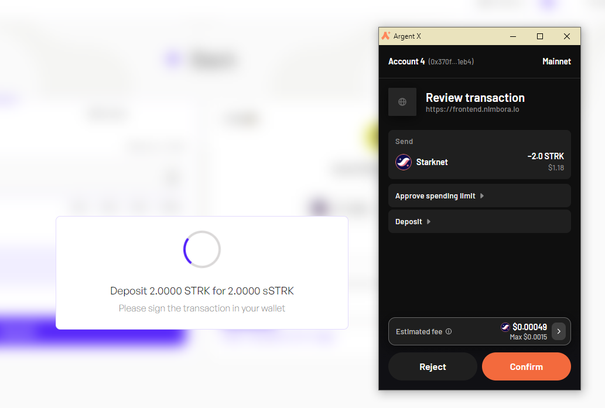
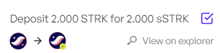
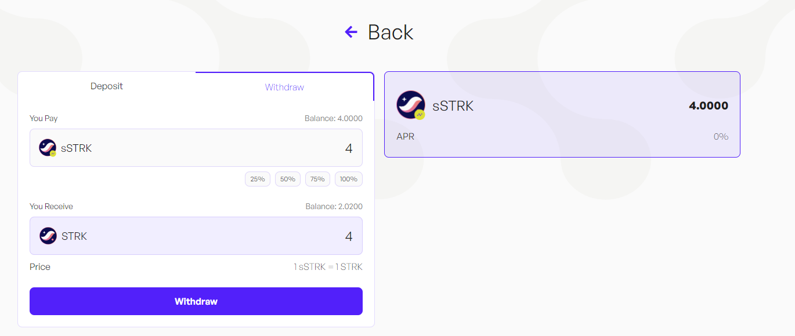
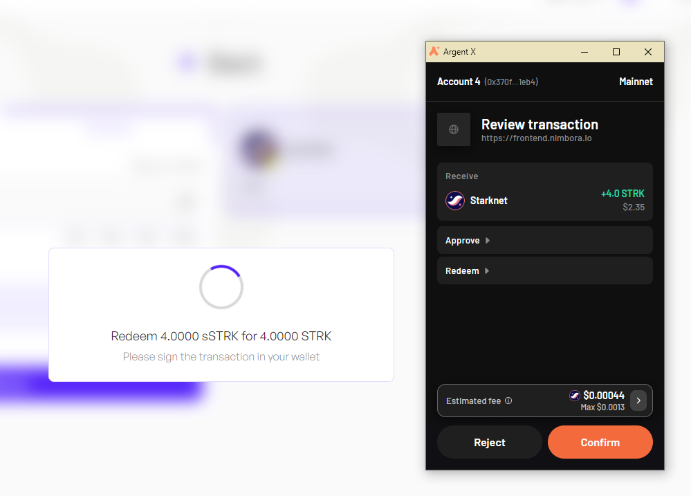
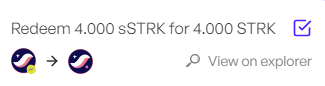
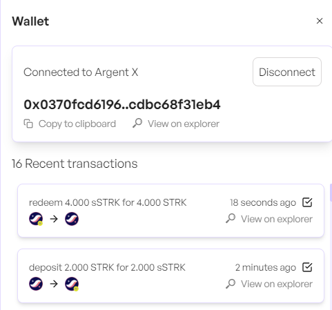

# **Introducing the Savings STRK (sSTRK) Vault**

You've asked, and we've delivered!

We're thrilled to announce the launch of the $sSTRK Vault, designed to maximize returns on $STRK for the entire Starknet ecosystem! 🐺

## **What is sSTRK?**

sSTRK stands for “Savings STRK,” similar to Spark’s sDAI (Savings DAI). 

The sSTRK vault is designed specifically for the Starknet ecosystem, providing a secure and efficient way to maximize the value of your STRK holdings. 

### **sSTRK Vault - How it Works**

Savings STRK Vault is an advanced yield aggregator pool that allows users to deposit STRK and get the best possible returns.

The sSTRK vault comes with full modular contract and will have enhanced functionalities with each release: 

### Stage 0 - The Genesis

We’re launching the genesis vault, and it will serve as the foundation for more advanced strategies in the future.

By depositing your STRK tokens into the vault, you will earn yield and accumulate Nimbora points at 2x rate and grow your position within the Nimbora ecosystem. 

We will funnel a part of the incentives to the sSTRK vault to enable yield for our users. This ensures that you continue to benefit from holding sSTRK while earning steady returns.

We are the recipient of the [Starknet Catalyst grant](https://medium.com/@Nimbora/nimbora-and-starknet-catalyst-program-14cc7f2f1ab5) and some of our vaults are receiving incentives from the Starknet Foundation as a part of the [DeFi Spring 2.0](https://medium.com/@Nimbora/introducing-defi-spring-2-0-bigger-bolder-better-364bb96b02d6)

### Stage 1 - Multiple Indexed Strategies

When users deposit their STRK into the Savings STRK vault, the system actively employs advanced DeFi strategies to generate potential profits over time, optimizing their earning potential through automated and strategic investments.

This strategy combines multiple steps: 
- Underlaying asset is deposited in the main vault.
- The amount deposited is split into the different strategies respecting the debt allocation provided by the debt manager.
- Profits generated are periodically compounded and debt is reallocated dynamically following market conditions
- Rewards from [DeFi Spring 2.0](https://medium.com/@Nimbora/introducing-defi-spring-2-0-bigger-bolder-better-364bb96b02d6) are automatically claimed and vested over a week into the strategy

The unique strategies could come from: 
- Pure Lending
- DeFi Pooling
- Liquidity provision in meta-stable pools
- Liquidity provision in option pools
- Staking

We plan to bring additional utility to the sSTRK vault by enabling users to stake, restake and borrow assets against their sSTRK and interact with our live strategies such as the [nsDAI](https://docs.nimbora.io/docs/concepts/products/earn/nsDAI) or [npeETH](https://docs.nimbora.io/docs/concepts/products/earn/pendle_lp_integration/npeETH) strategy.

## As an example we’ll use the connecting sSTRK with npeETH strategy

Our [npeETH strategy](https://docs.nimbora.io/docs/concepts/products/earn/pendle_lp_integration/npeETH) is designed to maximize your returns. By participating in this strategy, you not only earn additional yield, but also farm 3x Etherfi points, 1x EigenLayer points, and 1x Nimbora points. This multifaceted reward system ensures that your investments are continuously working hard for you, providing both immediate and long-term benefits.

In this scenario, you would be earning yields from both the sSTRK vault and npeETH strategy, as well as 3x Etherfi points, 3x Nimbora points and 1x EigenLayer points.

## TL;DR of the Upgraded sSTRK Vault

1. **Automated Yield Generation**: Vaults optimize yield farming by shifting capital between different DeFi protocols.
2. **Passive Investment Strategy**: Vaults automate complex processes, allowing users without deep DeFi knowledge to earn returns.
3. **Dynamic Rebalancing**: The system continually adjusts to maximize profits as market conditions change.
4. **Modular Architecture**: Simplifies strategy creation and maintenance, encouraging innovation and reducing error rates.
5. **ERC-4626 Compatibility**: Ensures easy integration with other DeFi projects.
6. **Share Locking**: Prevent Sandwich attack on the vault when claiming $STRK coming from DeFi Spring.

## Get Started!

To get involved with sSTRK vault, simply follow these steps:

Visit Nimbora dApp via invite link and connect your Starknet wallet ([Braavos](https://braavos.app/) or [ArgentX](https://argent.xyz/)).

Enter the amount of STRK  you want to deposit, or click on the small buttons below the box (25%, 50%, 75%, 100%) to set a desired percentage of the balance you want to deposit.

When you've selected the token amount to deposit, click on "Deposit" button.

Follow the prompts on your wallet ([Braavos](https://braavos.app/) or [ArgentX](https://argent.xyz/)) to complete the transaction.

Once the transaction has been accepted on the network, a popup will appear at the bottom right of the screen to let you know.

As a result, you will receive sSTRK. And that's it, you should be able to see your balance of Nimbora Yield Token in the portfolio section or directly into your wallet browser. 

## How to request a withdrawal

First, you need to decide on the amount you want to withdraw. This could be all or a portion of your assets.

Once you've made up your mind, locate and click on the 'withdraw' button and follow the prompts on your wallet (Argent or Braavos) to complete the transaction.

Once the transaction has been accepted on the network, a popup will appear at the bottom right of the screen to let you know. 

You can consult all of your recent transactions in the wallet section. Your transaction should be here. 

### Understanding Risks Associated with Savings STRK

1. **Smart Contract Risk**:
    - Savings STRK vault aggregator smart contracts risks.
    - Underlying tokenized strategy Component risks.
2. **Interaction with Third-party Protocols**:
    - Tokenized strategies are interacting with third party protcol such as AMM, lending borrowing or else... Looks at active strategies used by the main vault for more details.

### Stay Tuned for Upgrades

Keep an eye on our updates as we roll out new features and advanced strategies to enhance your earning potential.

**Join our [Discord](http://discord.gg/nimbora) for alpha and early notifications 🚀**

 

We’re excited to bring you this innovative new vault and can’t wait to see how you leverage it to maximize your STRK yields! Stay tuned for updates as we continue to bring more 1-click yield strategies to life and enhance the sSTRK vault. Follow [Nimbora on X](https://x.com/Nimbora_) (Twitter) or [Medium](https://medium.com/@Nimbora).

# **About Nimbora**

Nimbora is a Starknet-based omnichain 1-click yield strategies platform that enables users to engage with Layer 1 protocols at a fraction of the cost. Discover the best of Ethereum protocols and optimize your DeFi strategies with Nimbora.

🐧🌐 [Website](https://www.nimbora.io/)

🐧👨‍💻 [DApp](https://app.nimbora.io/)

🐧🐦 [Twitter](https://twitter.com/Nimbora_)

🐧👋 [Discord](http://discord.gg/nimbora)

🐧💼 [LinkedIn](https://www.linkedin.com/company/nimbora/)

🐧📖 [Medium](https://medium.com/@Nimbora)

🐧🗞️ [Docs](https://docs.nimbora.io/)

🐧🛡 [Audit](https://github.com/0xSpaceShard/nimbora_audit_report_yield_dex/blob/main/Nimbora%20Audit%20Report.pdf)