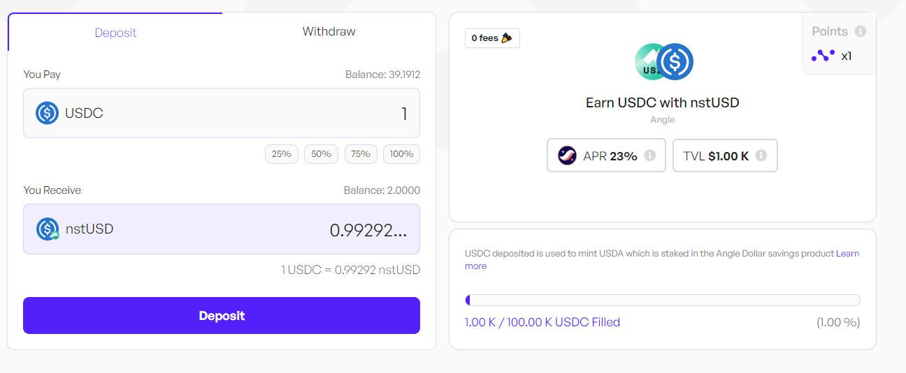

**This strategy allows users to leverage their USDC holdings** by minting stUSD, generating yields through RWAs and DeFi assets in Angle Protocol’s reserves.

## About Angle
[Angle](https://www.angle.money/) is a DeFi Protocol specializing in building resilient stablecoin infrastructures. The Protocol’s main products are USDA, the most reliable USD stablecoin, and EURA (formerly agEUR), the most traded Euro stablecoin. Known for its innovative stablecoin mechanisms and reliability, Angle is ranked among the safest DeFi protocols on DeFiSafety. Backed by Andreessen Horowitz (a16z), Angle operates as a Decentralized Autonomous Organization (DAO), ensuring community-driven governance with its veANGLE token used for voting governance proposals. Angle Labs, the main contributor to Angle Protocol, also powers [Merkl](https://merkl.xyz/), a platform enabling foundations, DAOs, and protocols such as Arbitrum, Uniswap, or Aave to create tailored and efficient on-chain incentive programs to optimize their liquidity and growth.

## Get Started

Visit Nimbora dApp via invite link and connect your Starknet wallet ([Braavos](https://braavos.app/) or [ArgentX](https://argent.xyz/)).

Enter the amount of ETH you want to deposit, or click on the small buttons below the box (25%, 50%, 75%, 100%) to set a desired percentage of the balance you want to deposit.

Enter the amount you want to deposit or click on the buttons to set a desired percentage of your balance you want to deposit. 

When you've selected the token amount to deposit, click on "deposit" and follow the prompts on your wallet ([Braavos](https://braavos.app/) or [ArgentX](https://argent.xyz/)) to complete the transaction.

Once the transaction has been accepted on the network, a popup will appear at the bottom right of the screen to let you know. 

And that's it, you should be able to see your balance of Nimbora yield token into the portfolio section or directly into your wallet browser. 

## Your Earning Starts Immediately!

Your yield comes from several sources -  **nstUSD  base yield** + **$STRK** **incentives** + **Nimbora** **boost.**

**Here's an APR breakdown of the nstUSD strategy**

1. **Base**: Represents default strategy yield that auto-compounds daily. 
2. **Boost**: Represents incentives provided by the Nimbora team using the [Starknet Catalyst grant](https://medium.com/@Nimbora/nimbora-and-starknet-catalyst-program-14cc7f2f1ab5) that are claimable every week at the [rewards page](https://app.nimbora.io/rewards/).
3. **Incentives**: Represents incentives provided by the Starknet Foundation as a part of the [DeFi Spring 2.0](https://medium.com/@Nimbora/introducing-defi-spring-2-0-bigger-bolder-better-364bb96b02d6) that are claimable every week at the [rewards page](https://app.nimbora.io/rewards/).
4. **Ekubo LP** Providing Nimbora yield bearing tokens as liquidity on Ekubo is tracked and added to the total claimable STRK amount at the [rewards page](https://app.nimbora.io/rewards/).

## How to request a withdrawal
You can choose between two withdrawal options - Instant and Normal.

Instant withdrawals factor in the price impact and set slippage. 

Normal withdrawals are not synchronous such as deposits and take between 12 and 48 hours to be processed.

Once you have selected the withdraw tab, you will need to decide on the amount you want to withdraw. This could be all or a portion of your assets.

Click on the 'withdraw' button and follow the prompts on your wallet ([Braavos](https://braavos.app/) or [ArgentX](https://argent.xyz/)) to complete the transaction.

Once the transaction has been accepted on the network, a popup will appear at the bottom right of the screen to let you know. 

You can consult all of your recent transactions in the wallet section. Your transaction should be here. 

And that's it, you should see your pending request in the navbar.

Nimbora takes over the task of processing this request. This involves preparing your assets in order to be transferred back to your wallet, a process that is handled entirely behind the scenes to ensure a smooth and efficient operation. Once the request is ready to be claimed, Nimbora relayer will handle it and send it directly into your wallet. 

### Stay Tuned for Upgrades

Keep an eye on our updates as we roll out new features and advanced strategies to enhance your earning potential.

**Join our [Discord](http://discord.gg/nimbora) for alpha and early notifications 🚀**

 

Stay tuned for updates as we continue to bring more 1-click yield strategies to life. Follow [Nimbora on X](https://x.com/Nimbora_) (Twitter) or [Medium](https://medium.com/@Nimbora).

# **About Nimbora**

Nimbora is a Starknet-based omnichain 1-click yield strategies platform that enables users to engage with Layer 1 protocols at a fraction of the cost. Discover the best of Ethereum protocols and optimize your DeFi strategies with Nimbora.

🐧🌐 [Website](https://www.nimbora.io/)

🐧👨‍💻 [DApp](https://app.nimbora.io/)

🐧🐦 [Twitter](https://twitter.com/Nimbora_)

🐧👋 [Discord](http://discord.gg/nimbora)

🐧💼 [LinkedIn](https://www.linkedin.com/company/nimbora/)

🐧📖 [Medium](https://medium.com/@Nimbora)

🐧🗞️ [Docs](https://docs.nimbora.io/)

🐧🛡 [Audit](https://github.com/0xSpaceShard/nimbora_audit_report_yield_dex/blob/main/Nimbora%20Audit%20Report.pdf)