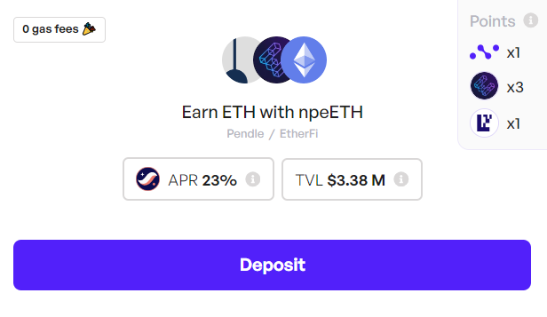
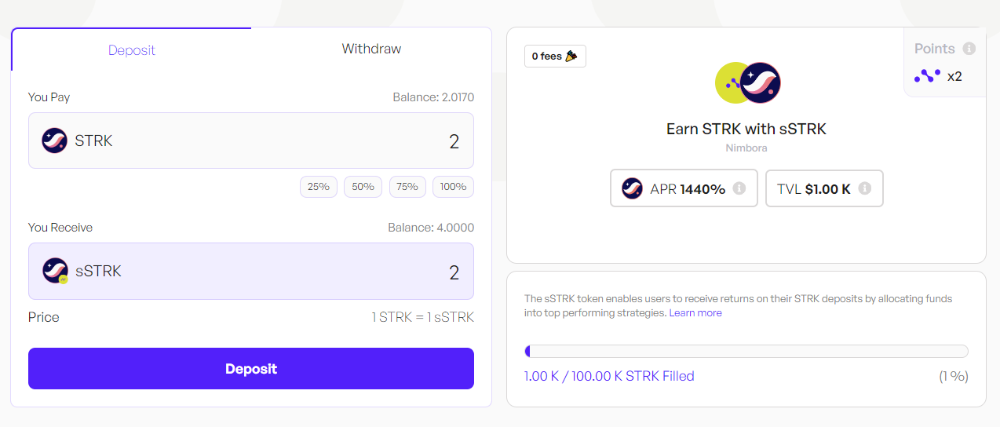
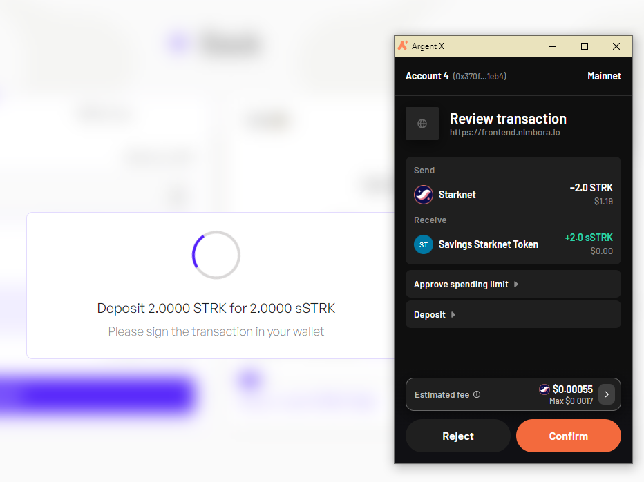
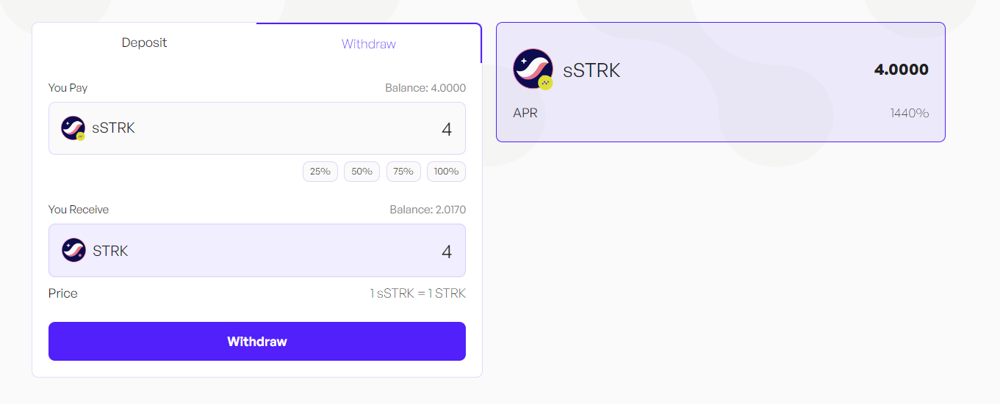
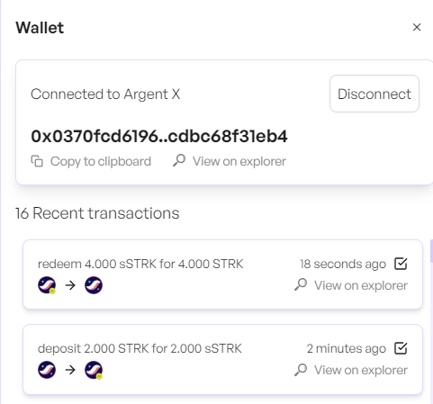

# **Introducing the sSTRK Vault**

## **What is sSTRK?**

sSTRK stands for “Savings STRK,” similar to Spark’s sDAI (Savings DAI). 

The sSTRK vault is designed specifically for the Starknet ecosystem, providing a secure and efficient way to maximize the value of your STRK holdings. We’re launching the genesis vault, and it will serve as the foundation for more advanced strategies in the future.

### **sSTRK Vault - How it Works**

The sSTRK vault is the starting point for our innovative yield strategies. 

The sSTRK vault comes with upgradable contract and will have enhanced functionalities with each release: 

### Stage 0 - The Genesis

By depositing your STRK tokens into the vault, you will accumulate Nimbora points at 2x rate and grow your position within the Nimbora ecosystem.

### Stage 1 - Simple Yield Strategy

We will funnel a part of the incentives to the sSTRK vault to enable yield for our users. This ensures that you continue to benefit from holding sSTRK while earning steady returns.

We are the recipient of the [Starknet Catalyst grant](https://medium.com/@Nimbora/nimbora-and-starknet-catalyst-program-14cc7f2f1ab5) and some of our vaults are receiving incentives from the Starknet Foundation as a part of the [DeFi Spring 2.0](https://medium.com/@Nimbora/introducing-defi-spring-2-0-bigger-bolder-better-364bb96b02d6)

### Stage 2 - Multiple Indexed Strategies

With our sSTRK vault, you are earning 2x [Nimbora points](https://docs.nimbora.io/docs/concepts/guide/points).  

We plan to bring additional utility to the sSTRK vault by enabling users to stake, restake and borrow assets against their sSTRK and interact with our live strategies such as the [nsDAI](https://docs.nimbora.io/docs/concepts/products/earn/nsDAI) or [npeETH](https://docs.nimbora.io/docs/concepts/products/earn/pendle_lp_integration/npeETH) strategy.

## As an example we’ll use the connecting sSTRK with npeETH strategy

Our [npeETH strategy](https://docs.nimbora.io/docs/concepts/products/earn/pendle_lp_integration/npeETH) is designed to maximize your returns. By participating in this strategy, you not only earn additional yield, but also farm 3x Etherfi points, 1x EigenLayer points, and 1x Nimbora points. This multifaceted reward system ensures that your investments are continuously working hard for you, providing both immediate and long-term benefits.

In this scenario, you would be earning yields from both the sSTRK vault and npeETH strategy, as well as 3x Etherfi points, 3x Nimbora points and 1x EigenLayer points.

## TL;DR of the Upgraded sSTRK Vault

1.	**Enhanced Yield**: By leveraging your sSTRK to borrow ETH and invest in high-yield strategies, you can significantly increase your returns.

2.	**Extra Points**: Farm additional points provided by our strategies.

3.	**Seamless Integration**: Enjoy the simplicity we offer. We handle upgrades in the background, manage multiple strategies, and ensure your STRK is always working to its fullest potential.

## Get Started!

To get involved with sSTRK vault, simply follow these steps:

Visit Nimbora dApp via invite link and connect your Starknet wallet ([Braavos](https://braavos.app/) or [ArgentX](https://argent.xyz/)).

Enter the amount of STRK  you want to deposit, or click on the small buttons below the box (25%, 50%, 75%, 100%) to set a desired percentage of the balance you want to deposit.

When you've selected the token amount to deposit, click on "Deposit" button.

Follow the prompts on your wallet ([Braavos](https://braavos.app/) or [ArgentX](https://argent.xyz/)) to complete the transaction.

Once the transaction has been accepted on the network, a popup will appear at the bottom left of the screen to let you know.

As a result, you will receive sSTRK, which is Liquid Restaking Token (LRT). And that's it, you should be able to see your balance of Nimbora Yield Token in the portfolio section or directly into your wallet browser. 

## How to request a withdrawal

Withdrawal are not synchronous such as deposits.  Withdrawals take between 12 and 48 hours to be processed. A fast withdrawal option should arrive later on. 

First, you need to decide on the amount you want to withdraw. This could be all or a portion of your assets.

Once you've made up your mind, locate and click on the 'withdraw' button and follow the prompts on your wallet (Argent or Braavos) to complete the transaction.

Once the transaction has been accepted on the network, a popup will appear at the bottom right of the screen to let you know. 

You can consult all of your recent tarnsactions in the wallet section. Your transaction should be here. 

And that's it, you should see your pending request in the navbar.

### Stay Tuned for Upgrades

Keep an eye on our updates as we roll out new features and advanced strategies to enhance your earning potential.

**Join our [Discord](http://discord.gg/nimbora) for alpha and early notifications 🚀**

 

We’re excited to bring you this innovative new vault and can’t wait to see how you leverage it to maximize your STRK yields! Stay tuned for updates as we continue to bring more 1-click yield strategies to life and enhance the sSTRK vault. Follow [Nimbora on X](https://x.com/Nimbora_) (Twitter) or [Medium](https://medium.com/@Nimbora).

# **About Nimbora**

Nimbora is a Starknet-based omnichain 1-click yield strategies platform that enables users to engage with Layer 1 protocols at a fraction of the cost. Discover the best of Ethereum protocols and optimize your DeFi strategies with Nimbora.

🐧🌐 [Website](https://www.nimbora.io/)

🐧👨‍💻 [DApp](https://app.nimbora.io/)

🐧🐦 [Twitter](https://twitter.com/Nimbora_)

🐧👋 [Discord](http://discord.gg/nimbora)

🐧💼 [LinkedIn](https://www.linkedin.com/company/nimbora/)

🐧📖 [Medium](https://medium.com/@Nimbora)

🐧🗞️ [Docs](https://docs.nimbora.io/)

🐧🛡 [Audit](https://github.com/0xSpaceShard/nimbora_audit_report_yield_dex/blob/main/Nimbora%20Audit%20Report.pdf)