**Pendle LP strategy, earn with ETH**

Liquid restaking on Ethereum repurposes staked ether to validate external systems like rollups or oracles, enhancing the ecosystem's security. Liquid Restaking Tokens (LRTs) act as a buffer against slashing events and offer higher yields than native staking. They simplify participation, manage risks, and conserve gas by batch-collecting rewards. This innovation democratizes staking, challenging established leaders, and offers growth potential, albeit with capped deposits in some systems.

weETH is the wrapped version of eETH, the etherfi native token, which serves as a liquid staking derivative token. eETH streamlines the staking process by enabling automatic restaking and offering various benefits to users. This includes rewards from both EtherFi and EigenLayer, simplifying the staking experience and providing additional incentives for participation in the DeFi ecosystem.

Yield come from several sources:

- Ethereum execution and consensus layer staking rewards
- Loyalty points
- EigenLayer restaking rewards

## Get Started

Visit [Nimbora dApp](https://app.nimbora.io) via invite link and connect your Starknet wallet ([Braavos](https://braavos.app/) or [ArgentX](https://argent.xyz/)).

Enter the amount of ETH you want to deposit, or click on the small buttons below the box (25%, 50%, 75%, 100%) to set a desired percentage of the balance you want to deposit.

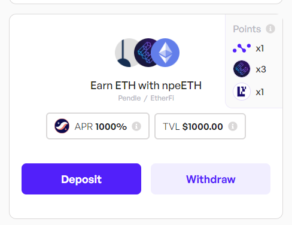

When you've selected the token amount to deposit, click on "Deposit" button.
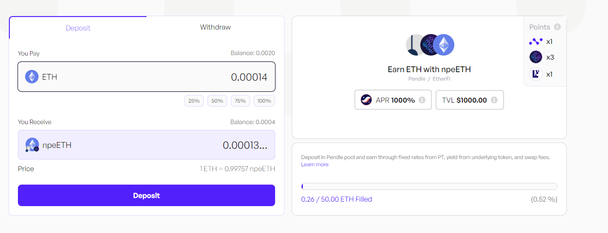

Follow the prompts on your wallet ([Braavos](https://braavos.app/) or [ArgentX](https://argent.xyz/)) to complete the transaction.

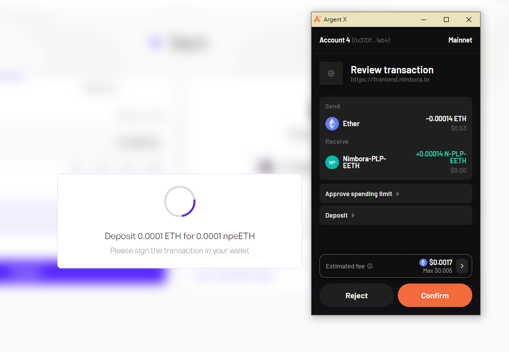

Once the transaction has been accepted on the network, a popup will appear at the bottom left of the screen to let you know.
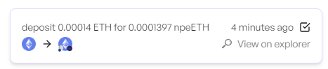

As a result, you will receive npeETH - Nimbora yield bearing token. And that's it, you should be able to see your balance of Nimbora Yield Token in the portfolio section or directly into your wallet browser.

## Your Earning Starts Immediately!

Your yield comes from several sources -  **npeETH base yield** + **$STRK** **incentives** + **Nimbora** **boost.**

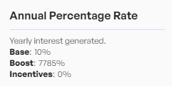

1. **Base**: Represents default strategy yield that auto-compounds daily. We take a 20% performance fee. The APRs displayed are what you actually receive, as our performance fee has already been accounted for.
2. **Boost**: Represents incentives provided by the Nimbora team using the [Starknet Catalyst grant](https://medium.com/@Nimbora/nimbora-and-starknet-catalyst-program-14cc7f2f1ab5) that are claimable every week at the [rewards page](https://app.nimbora.io/rewards/).
3. **Incentives**: Represents incentives provided by the Starknet Foundation as a part of the [DeFi Spring 2.0](https://medium.com/@Nimbora/introducing-defi-spring-2-0-bigger-bolder-better-364bb96b02d6) that are claimable every week at the [rewards page](https://app.nimbora.io/rewards/).
4. **Extra: Ekubo LP** Providing Nimbora yield bearing tokens as liquidity on Ekubo is tracked and added to the total claimable STRK amount at the [rewards page](https://app.nimbora.io/rewards/).

With this strategy you are also earning points for 3 protocols: 1x Nimbora, 3x EtherFi, 1x EigenLayer.
The points are harvested by our L1 smart contract. Users will have an option of voting on whether these points get sold or delegated to an EVM address.

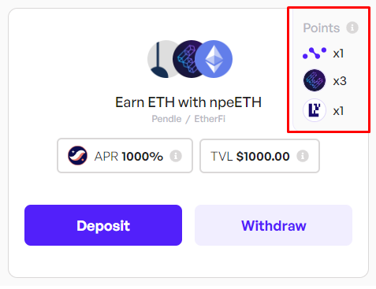

Remember, holding Nimbora yield-bearing tokens gets points based on your balance. The more and longer you hold, the more points you accumulate.

You can always check your leaderboard position and Nimbora points breakdown by clicking on ‘Points’ section in the upper left corner at app.nimbora.io

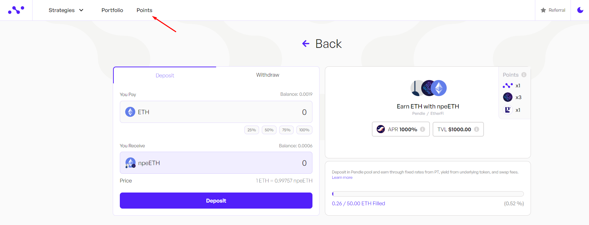

## How to Withdraw

You can choose between two withdrawal options - Instant and Normal.

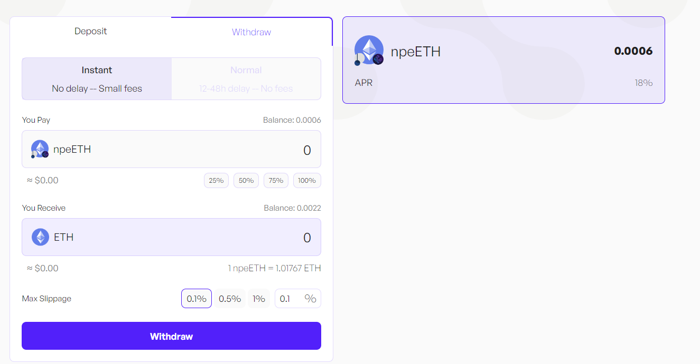

Instant withdrawals factor in the price impact and set slippage.

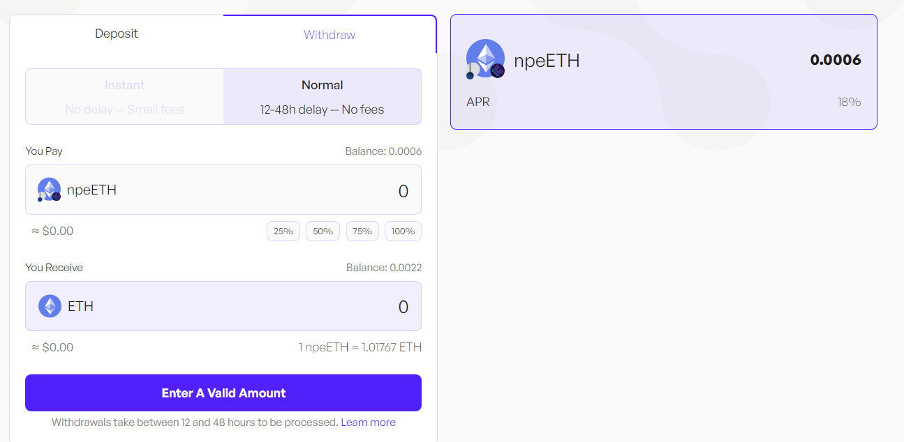

Normal withdrawals are not synchronous such as deposits and take between 24 and 72 hours to be processed.

Once you have selected the withdraw tab, you will need to decide on the amount you want to withdraw. This could be all or a portion of your assets.

Click on the 'withdraw' button and follow the prompts on your wallet ([Braavos](https://braavos.app/) or [ArgentX](https://argent.xyz/)) to complete the transaction.

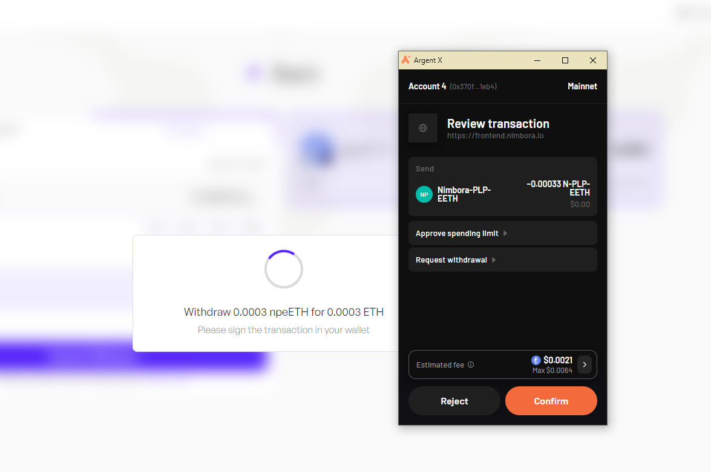

Once the transaction has been accepted on the network, a popup will appear at the bottom right of the screen to let you know.

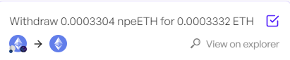

You can consult all of your recent transactions in the wallet section. Your transaction should be here.

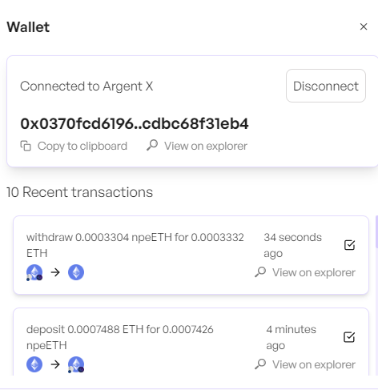

Nimbora takes over the task of processing this request. This involves preparing your assets in order to be transferred back to your wallet, a process that is handled entirely behind the scenes to ensure a smooth and efficient operation. Once the request is ready to be claimed, Nimbora relayer will handle it and send it directly into your wallet.

### What is EtherFI

- Non-Custodial Staking: EtherFi disrupts the decentralized finance (DeFi) space by offering non-custodial Ethereum staking. Users maintain full control over their keys, ensuring security and independence in the staking process. This approach contrasts with traditional custodial services where users relinquish control of their assets to third-party entities.
- Integration with EigenLayer for Enhanced Yields: EtherFi collaborates with EigenLayer, a protocol that increases rewards and boosts the value of DeFi by supporting simpler restaking. Through this integration, users can earn additional yields on top of Ethereum's staking rewards without locking up their assets, promoting flexibility and maximizing earning potential.

### Understanding Risks Associated with EtherFi

1. **Smart Contract Risks**:

   - Though EtherFi's smart contracts are crafted carefully, audited, and thoroughly tested, there always exist risks in interacting with smart contracts on the Ethereum network.

2. **Key Management Risks**:

   - With EtherFi's desktop and decentralized web applications, efforts are made to utilize the latest, safest methods for key encryption and protection. However, EtherFi cannot guarantee or represent that their methods are or will remain 100% secure. Additionally, the responsibility for key management lies in the hands of the user, and preventing user errors, while a primary aim, is virtually impossible.

3. **Regulatory Risks**:
   - EtherFi believes in the potential of the Ethereum network to become the settlement layer for global financial markets. However, this conviction does not guarantee the future. Cryptocurrencies, including Ethereum, have faced increased governmental scrutiny as they transition from niche to mainstream. Regulatory risks include, but are not limited to:
     - Bans on cloud service providers offering services to crypto-related enterprises.
     - Bans on ISPs providing crypto-related services.
     - Onerous taxes levied on various network transactions.

### Stay Tuned for Upgrades

Keep an eye on our updates as we roll out new features and advanced strategies to enhance your earning potential.

**Join our [Discord](http://discord.gg/nimbora) for alpha and early notifications 🚀**

Stay tuned for updates as we continue to bring more 1-click yield strategies to life. Follow [Nimbora on X](https://x.com/Nimbora_) (Twitter) or [Medium](https://medium.com/@Nimbora).

# **About Nimbora**

Nimbora is a Starknet-based omnichain 1-click yield strategies platform that enables users to engage with Layer 1 protocols at a fraction of the cost. Discover the best of Ethereum protocols and optimize your DeFi strategies with Nimbora.

🐧🌐 [Website](https://www.nimbora.io/)

🐧👨‍💻 [DApp](https://app.nimbora.io/)

🐧🐦 [Twitter](https://twitter.com/Nimbora_)

🐧👋 [Discord](http://discord.gg/nimbora)

🐧💼 [LinkedIn](https://www.linkedin.com/company/nimbora/)

🐧📖 [Medium](https://medium.com/@Nimbora)

🐧🗞️ [Docs](https://docs.nimbora.io/)

🐧🛡 [Yield Dex Audit](https://github.com/0xSpaceShard/nimbora_audit_report_yield_dex/blob/main/Nimbora%20Audit%20Report.pdf)

🐧🛡 [LST Audit](https://github.com/0xSpaceShard/nimbora-lst-public-audit/blob/main/Nimbora%20-%20Zellic%20Audit%20Report.pdf)
