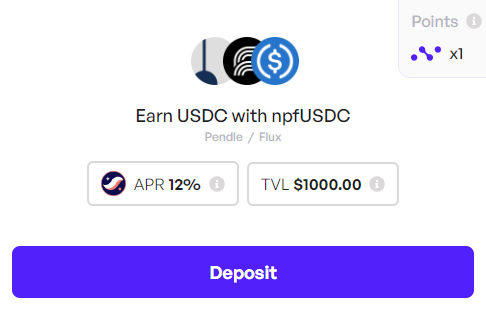
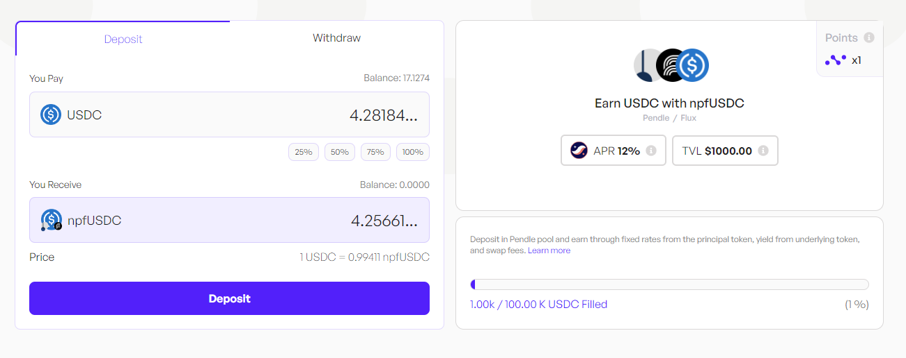
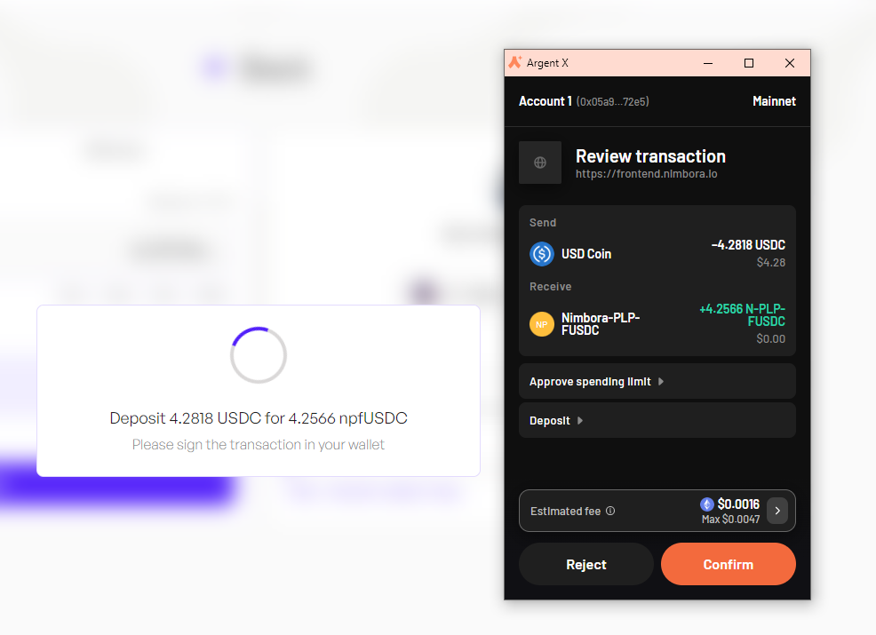
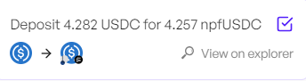
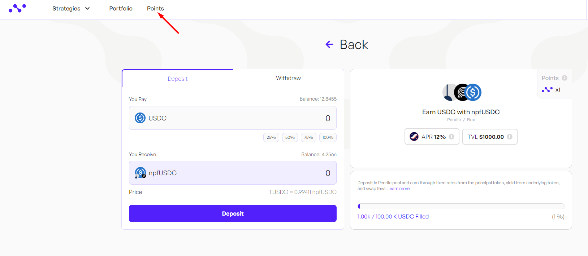
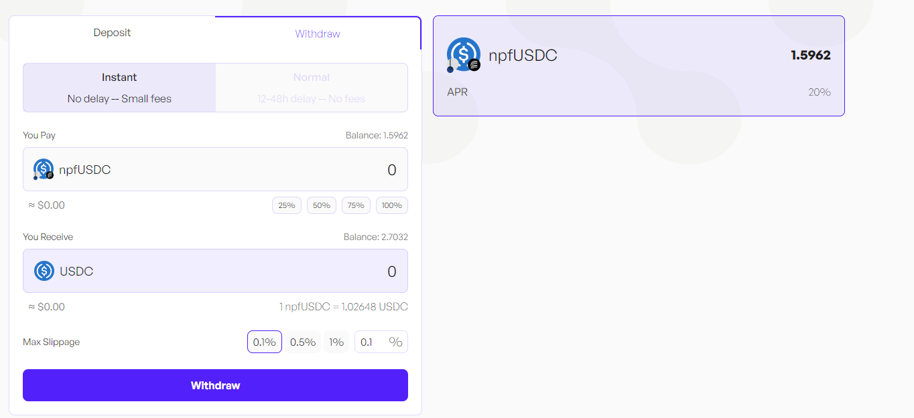
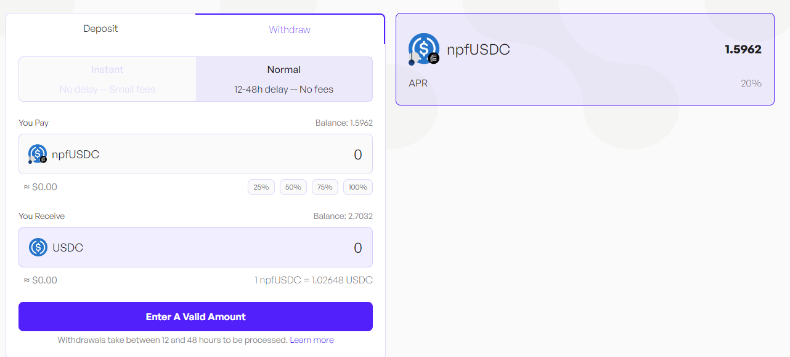
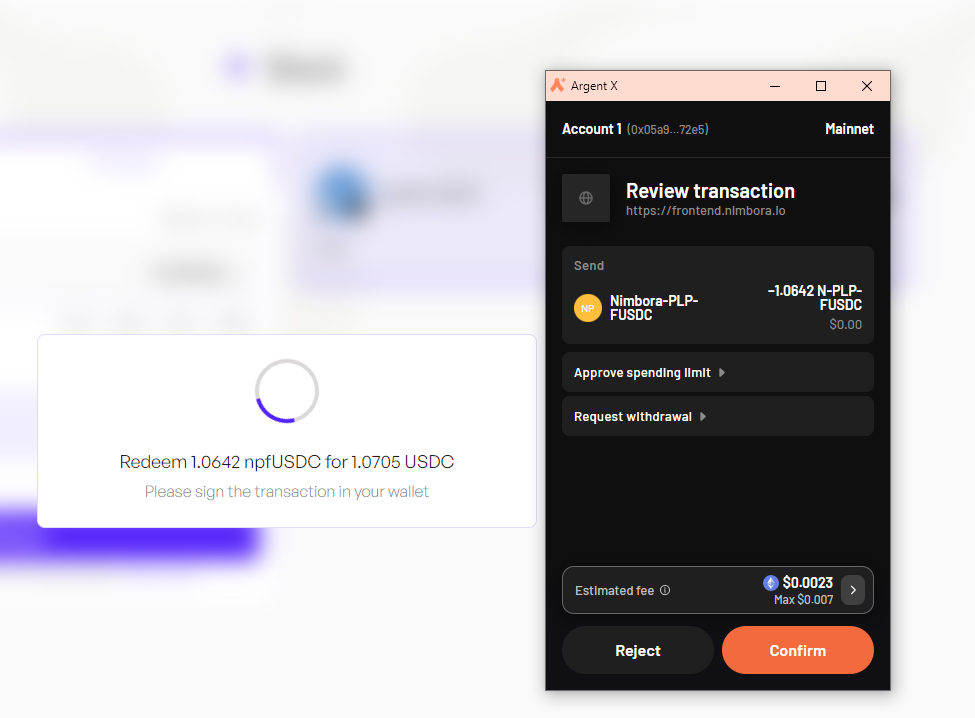
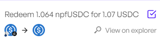
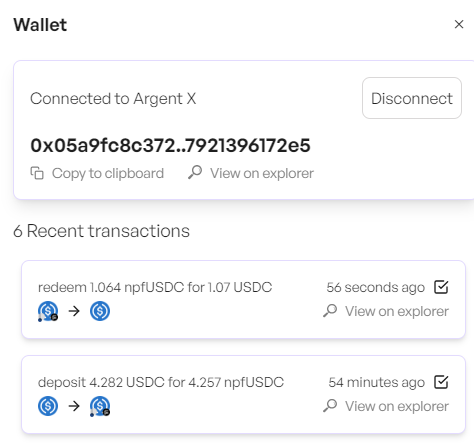

**Pendle LP strategy, earn with USDC** 

FUSDC is an interest-bearing token received when depositing USDC into Flux Finance's lending pools. FUSDC represents a user's deposited USDC plus accrued interest. Users earn interest on their deposited USDC in the form of FUSDC, which grows over time based on the interest rate offered by the lending pool.

## Get Started

Visit Nimbora dApp via invite link and connect your Starknet wallet ([Braavos](https://braavos.app/) or [ArgentX](https://argent.xyz/)).

Enter the amount of USDC you want to deposit, or click on the small buttons below the box (25%, 50%, 75%, 100%) to set a desired percentage of the balance you want to deposit.

When you've selected the token amount to deposit, click on "Deposit" button. 

Follow the prompts on your wallet ([Braavos](https://braavos.app/) or [ArgentX](https://argent.xyz/)) to complete the transaction.

Once the transaction has been accepted on the network, a popup will appear at the bottom left of the screen to let you know.

As a result, you will receive npfUSDC, Nimbora yield bearing token. And that's it, you should be able to see your balance of Nimbora Yield Token in the portfolio section or directly into your wallet browser.

## Your Earning Starts Immediately

Your yield comes from several sources -  **npfUSDC base yield** + **$STRK** **incentives** + **Nimbora** **boost.**

1. **Base**: Represents default strategy yield that auto-compounds daily.  We take a 20% performance fee. The APRs displayed are what you actually receive, as our performance fee has already been accounted for.
2. **Boost**: Represents incentives provided by the Nimbora team using the [Starknet Catalyst grant](https://medium.com/@Nimbora/nimbora-and-starknet-catalyst-program-14cc7f2f1ab5) that are claimable every week at the [rewards page](https://app.nimbora.io/rewards/).
3. **Incentives**: Represents incentives provided by the Starknet Foundation as a part of the [DeFi Spring 2.0](https://medium.com/@Nimbora/introducing-defi-spring-2-0-bigger-bolder-better-364bb96b02d6) that are claimable every week at the [rewards page](https://app.nimbora.io/rewards/).
4. **Extra: Ekubo LP** Providing Nimbora yield bearing tokens as liquidity on Ekubo is tracked and added to the total claimable STRK amount at the [rewards page](https://app.nimbora.io/rewards/).

With this strategy you are also earning Nimbora points. 
Remember, holding Nimbora yield-bearing tokens gets points based on your balance. The more and longer you hold, the more points you accumulate.

You can always check your leaderboard position and Nimbora points breakdown by clicking on ‘Points’ section in the upper left corner at app.nimbora.io

## How to Withdraw

You can choose between two withdrawal options - Instant and Normal.

Instant withdrawals factor in the price impact and set slippage. 

Normal withdrawals are not synchronous such as deposits and take between 24 and 48 hours to be processed.

Once you have selected the withdraw tab, you will need to decide on the amount you want to withdraw. This could be all or a portion of your assets.

Click on the 'withdraw' button and follow the prompts on your wallet ([Braavos](https://braavos.app/) or [ArgentX](https://argent.xyz/)) to complete the transaction.

Once the transaction has been accepted on the network, a popup will appear at the bottom right of the screen to let you know.

You can consult all of your recent transactions in the wallet section. Your transaction should be here. 

Nimbora takes over the task of processing this request. This involves preparing your assets in order to be transferred back to your wallet, a process that is handled entirely behind the scenes to ensure a smooth and efficient operation. Once the request is ready to be claimed, Nimbora relayer will handle it and send it directly into your wallet.

### What is FLUX

  - Decentralized Lending and Borrowing: Flux Protocol, developed by the Ondo Finance team, facilitates decentralized lending and borrowing. It allows users to lend their assets to earn interest or borrow assets against collateral in a peer-to-pool (P2Pool) model.
  - Support for Permissionless and Permissioned Tokens: Flux Protocol supports both permissionless tokens (e.g., USDC) and permissioned tokens (e.g., OUSG), with permissions enforced on a per-asset basis. This flexibility accommodates various token types and use cases within the protocol.

### Understanding Risks Associated with Flux

1. **Smart Contract Risk**: Flux operates on smart contracts, which are lines of code stored on the blockchain. While these smart contracts are designed to execute transactions autonomously, they are not immune to bugs or vulnerabilities. If there is a flaw in the smart contract's code, it could be exploited by malicious actors, potentially resulting in the loss of funds for lenders.

2. **Oracle Risk**: Flux relies on oracles to fetch external data, such as asset prices, to determine variables like interest rates and collateralization ratios. However, if these oracles provide inaccurate or manipulated data, it could lead to incorrect loan liquidations or interest rate adjustments, potentially causing losses for lenders.

3. **Market Risk**: The cryptocurrency and DeFi markets are highly volatile. The value of assets used as collateral for loans can fluctuate rapidly, and borrowers may struggle to repay their loans if the value of their collateral drops significantly. In such cases, lenders may face losses if they cannot recover the full value of the loan.

4. **Liquidity Risk**: Flux relies on liquidity pools to match lenders with borrowers. If there is insufficient liquidity in the pools, lenders may not be able to withdraw their funds in a timely manner or at the desired exchange rate. Additionally, sudden spikes in demand for loans or withdrawals could lead to slippage or delays in transactions.

5. **Counterparty Risk**: While Flux is designed to be decentralized, there is still some counterparty risk associated with lending and borrowing. If a borrower defaults on their loan, lenders may not be able to recover their full principal and interest payments, especially if there are not enough liquidated assets to cover the debt.

6. **Regulatory Risk**: The regulatory environment surrounding DeFi and cryptocurrencies is still evolving, and there is uncertainty regarding how regulators will treat these platforms in the future. Changes in regulations or enforcement actions could have a significant impact on the operation of Flux and the value of assets held within the protocol.

### Stay Tuned for Upgrades

Keep an eye on our updates as we roll out new features and advanced strategies to enhance your earning potential.

**Join our [Discord](http://discord.gg/nimbora) for alpha and early notifications 🚀**

 

Stay tuned for updates as we continue to bring more 1-click yield strategies to life. Follow [Nimbora on X](https://x.com/Nimbora_) (Twitter) or [Medium](https://medium.com/@Nimbora).

# **About Nimbora**

Nimbora is a Starknet-based omnichain 1-click yield strategies platform that enables users to engage with Layer 1 protocols at a fraction of the cost. Discover the best of Ethereum protocols and optimize your DeFi strategies with Nimbora.

🐧🌐 [Website](https://www.nimbora.io/)

🐧👨‍💻 [DApp](https://app.nimbora.io/)

🐧🐦 [Twitter](https://twitter.com/Nimbora_)

🐧👋 [Discord](http://discord.gg/nimbora)

🐧💼 [LinkedIn](https://www.linkedin.com/company/nimbora/)

🐧📖 [Medium](https://medium.com/@Nimbora)

🐧🗞️ [Docs](https://docs.nimbora.io/)

🐧🛡 [Audit](https://github.com/0xSpaceShard/nimbora_audit_report_yield_dex/blob/main/Nimbora%20Audit%20Report.pdf)