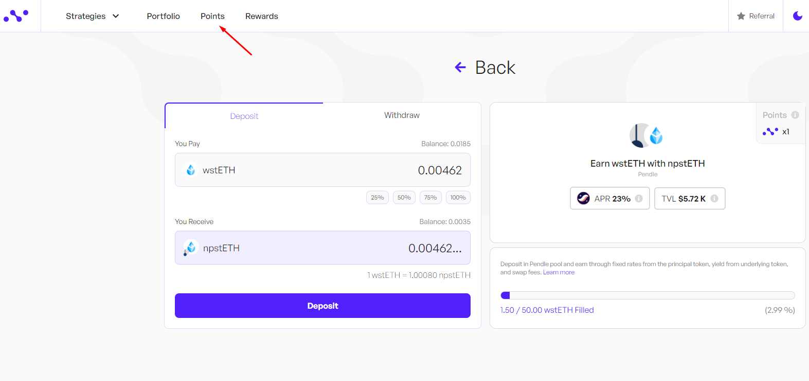
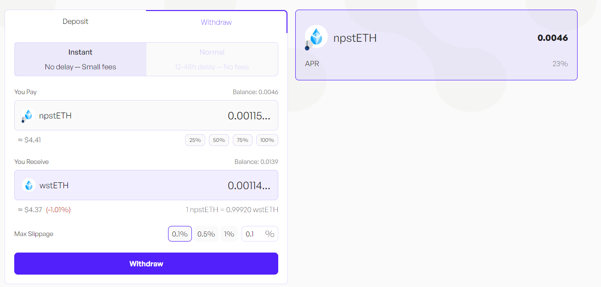
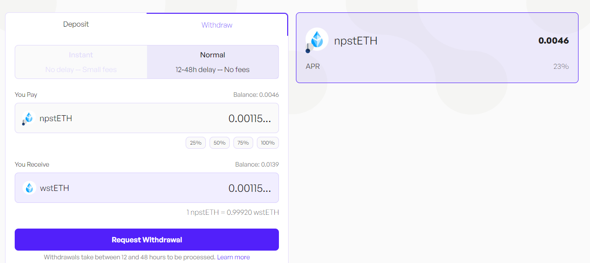

**Pendle LP strategy, earn with wstETH** 

wstETH is a wrapped version of stETH. Wrapping stETH creates a DeFi-compatible version of the stETH token which allows for easier integrations with DeFi protocols including Uniswap and MakerDao. 

**What is Lido** 

Lido is a liquid staking protocol backed by industry-leading staking providers that supports staking for Ethereum and Polygon. Lido lets users stake their tokens - without locking tokens or maintaining infrastructure - whilst participating in on-chain activities, e.g. lending, farming and more.

## Get Started

Visit Nimbora dApp via invite link and connect your Starknet wallet ([Braavos](https://braavos.app/) or [ArgentX](https://argent.xyz/)).

Enter the amount of ETH you want to deposit, or click on the small buttons below the box (25%, 50%, 75%, 100%) to set a desired percentage of the balance you want to deposit.

When you've selected the token amount to deposit, click on "Deposit" button. 

Follow the prompts on your wallet ([Braavos](https://braavos.app/) or [ArgentX](https://argent.xyz/)) to complete the transaction.

Once the transaction has been accepted on the network, a popup will appear at the bottom left of the screen to let you know.

As a result, you will receive wstETH, which is Liquid Restaking Token (LRT). And that's it, you should be able to see your balance of Nimbora Yield Token in the portfolio section or directly into your wallet browser.

## Your Earning Starts Immediately

Your yield comes from several sources -  **npstETH base yield** + **$STRK** **incentives** + **Nimbora** **boost.**

1. **Base**: Represents default strategy yield that auto-compounds daily. 
2. **Boost**: Represents incentives provided by the Nimbora team using the [Starknet Catalyst grant](https://medium.com/@Nimbora/nimbora-and-starknet-catalyst-program-14cc7f2f1ab5) that are claimable every two weeks.
3. **Incentives**: Represents incentives provided by the Starknet Foundation as a part of the [DeFi Spring 2.0](https://medium.com/@Nimbora/introducing-defi-spring-2-0-bigger-bolder-better-364bb96b02d6) that are claimable every two weeks.

With this strategy you are also earning Nimbora points. 
Remember, holding Nimbora yield-bearing tokens gets points based on your balance. The more and longer you hold, the more points you accumulate.

You can always check your leaderboard position and Nimbora points breakdown by clicking on ‘Points’ section in the upper left corner at app.nimbora.io

## How to Withdraw

You can choose between two withdrawal options - Instant and Normal.

Instant withdrawals factor in the price impact and set slippage. 

Normal withdrawals are not synchronous such as deposits and take between 12 and 48 hours to be processed.

Once you have selected the withdraw tab, you will need to decide on the amount you want to withdraw. This could be all or a portion of your assets.

Click on the 'withdraw' button and follow the prompts on your wallet ([Braavos](https://braavos.app/) or [ArgentX](https://argent.xyz/)) to complete the transaction.

Once the transaction has been accepted on the network, a popup will appear at the bottom right of the screen to let you know.

You can consult all of your recent transactions in the wallet section. Your transaction should be here. 

### Stay Tuned for Upgrades

Keep an eye on our updates as we roll out new features and advanced strategies to enhance your earning potential.

**Join our [Discord](http://discord.gg/nimbora) for alpha and early notifications 🚀**

 

Stay tuned for updates as we continue to bring more 1-click yield strategies to life. Follow [Nimbora on X](https://x.com/Nimbora_) (Twitter) or [Medium](https://medium.com/@Nimbora).

# **About Nimbora**

Nimbora is a Starknet-based omnichain 1-click yield strategies platform that enables users to engage with Layer 1 protocols at a fraction of the cost. Discover the best of Ethereum protocols and optimize your DeFi strategies with Nimbora.

🐧🌐 [Website](https://www.nimbora.io/)

🐧👨‍💻 [DApp](https://app.nimbora.io/)

🐧🐦 [Twitter](https://twitter.com/Nimbora_)

🐧👋 [Discord](http://discord.gg/nimbora)

🐧💼 [LinkedIn](https://www.linkedin.com/company/nimbora/)

🐧📖 [Medium](https://medium.com/@Nimbora)

🐧🗞️ [Docs](https://docs.nimbora.io/)

🐧🛡 [Audit](https://github.com/0xSpaceShard/nimbora_audit_report_yield_dex/blob/main/Nimbora%20Audit%20Report.pdf)