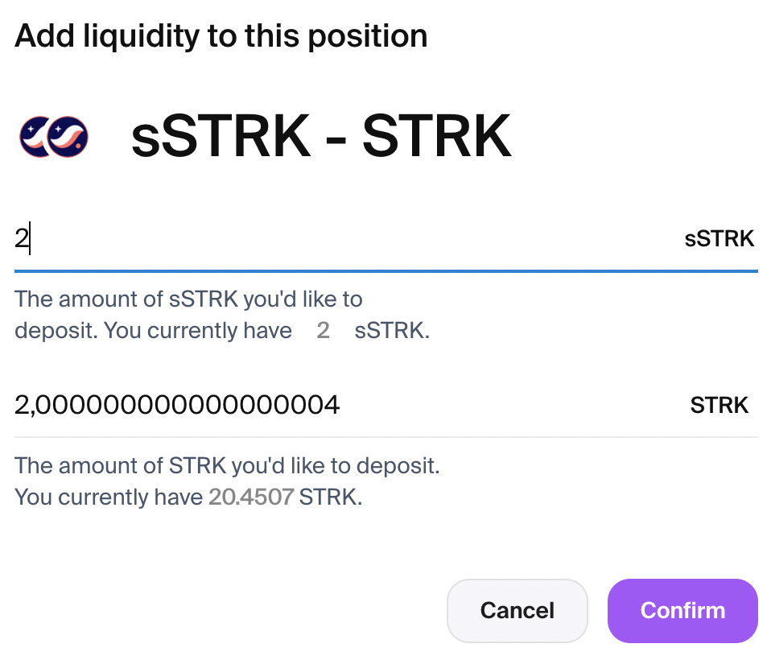
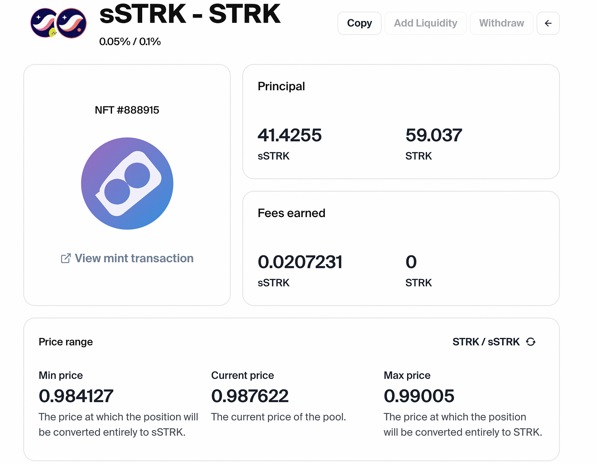
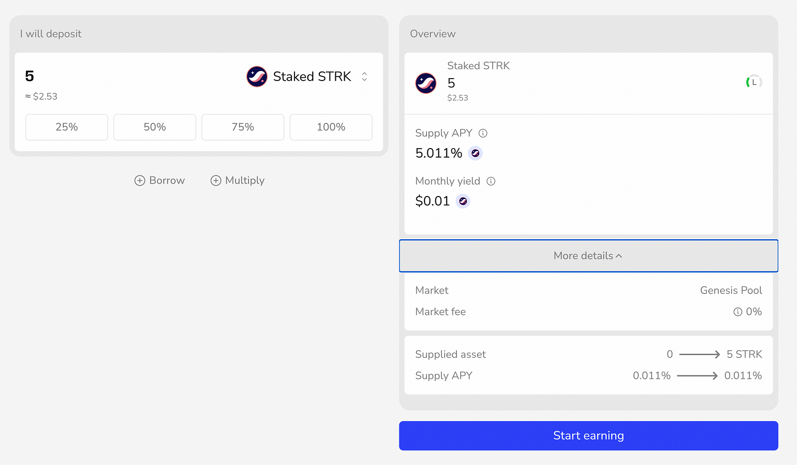

## What can you do with your sSTRK?

### 1. Provide Liquidity on Ekubo

Put your sSTRK to work in Ekubo’s liquidity pools, by providing liquidity to the sSTRK/STRK pool 👇
 https://app.ekubo.org/positions/0x534e5f4d41494e/0x02e0af29598b407c8716b17f6d2795eca1b471413fa03fb145a5e33722184067/888915

Enter the amount of sSTRK and STRK you’d like to add and click “Confirm” and follow the wallet prompts.

You will receive an NFT representing your position, where you can track earned rewards.

You get:

- Trading fees from all pool activity
- Extra DeFi Spring incentives
- 2x Nimbora tokens for being a liquidity provider
- Continue earning standard staking rewards
- Contribute to the ecosystem’s liquidity

### 2. Lending on Vesu

Generate additional yield by lending your sSTRK in Vesu’s lending market

➡️ https://vesu.xyz/lend

Stack multiple benefits:

- Earn lending APR
- Receive double Nimbora points
- Support Starknet’s lending markets

You can earn from staking, trading fees, lending, and protocol incentives, all while maintaining flexibility to switch between different strategies as market conditions change. This means you can stack multiple reward streams on top of your base staking position, optimizing your yields based on market opportunities.

# **Security First**

At Nimbora, your security is our top priority. We're proud to announce two significant security partnerships:

### **✅ Zellic Security Audit**

Our smart contracts have been thoroughly audited by Zellic, a leading blockchain security firm trusted by major protocols in the industry. 
👉 [Get the audit here.](https://github.com/0xSpaceShard/nimbora-lst-public-audit/blob/main/Nimbora%20-%20Zellic%20Audit%20Report.pdf)

Their comprehensive audit ensures our contracts meet the highest security standards.

### **🛡️ Hypernative Integration**

We've partnered with Hypernative for proactive hack prevention:

🔹 Real-time threat detection and monitoring

🔹 Prevention of attacks before any damage occurs

🔹 Smart filtering to alert only on critical security concerns

### 🔄 Validator Architecture

Our validator architecture adopts a methodical approach to decentralization:

🔹 Multi-validator support Q1 2025 

🔹 Systematic expansion as the ecosystem grows

These measures demonstrate our commitment to building a secure and reliable protocol for our users. By combining thorough auditing, proactive security measures, and a methodical path to decentralization, we're creating multiple layers of protection for your assets.

## What’s next for sSTRK?

**What’s coming next on Nimbora** is going to be a second transformative step we’re going to make in the Starknet ecosystem journey! More information will be revealed very soon, so stay with us.

**Join our [Discord](http://discord.gg/nimbora) for alpha and early notifications 🚀**

# **About Nimbora**

Nimbora is a Starknet-based omnichain 1-click yield strategies platform that enables users to engage with Layer 1 protocols at a fraction of the cost. Discover the best of Ethereum protocols and optimize your DeFi strategies with Nimbora.

🐧🌐 [Website](https://www.nimbora.io/)

🐧👨‍💻 [DApp](https://app.nimbora.io/)

🐧🐦 [Twitter](https://twitter.com/Nimbora_)

🐧👋 [Discord](http://discord.gg/nimbora)

🐧💼 [LinkedIn](https://www.linkedin.com/company/nimbora/)

🐧📖 [Medium](https://medium.com/@Nimbora)

🐧🗞️ [Docs](https://docs.nimbora.io/)

🐧🛡 [Yield Dex Audit](https://github.com/0xSpaceShard/nimbora_audit_report_yield_dex/blob/main/Nimbora%20Audit%20Report.pdf)

🐧🛡 [LST Audit](https://github.com/0xSpaceShard/nimbora-lst-public-audit/blob/main/Nimbora%20-%20Zellic%20Audit%20Report.pdf)