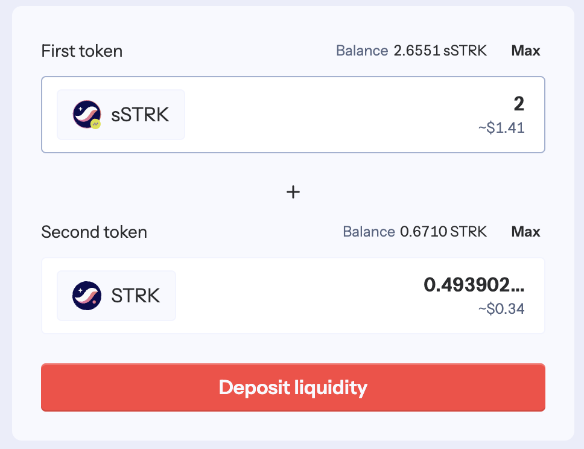
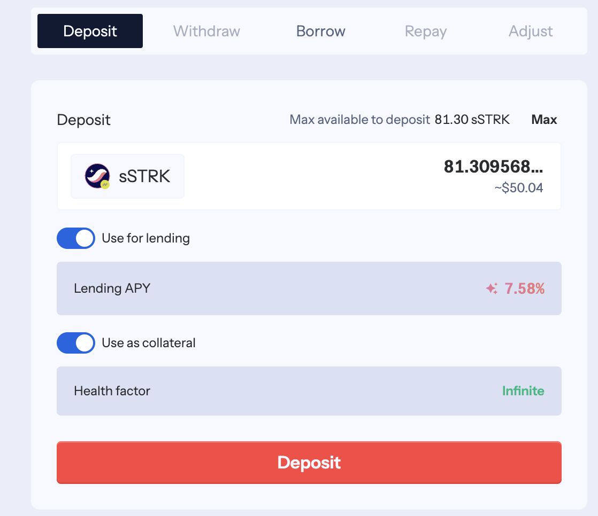
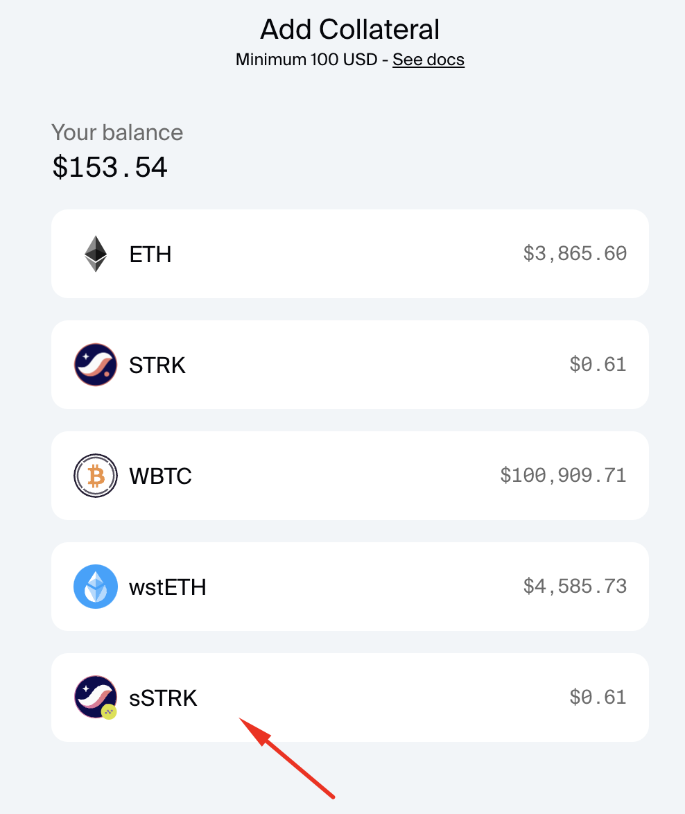
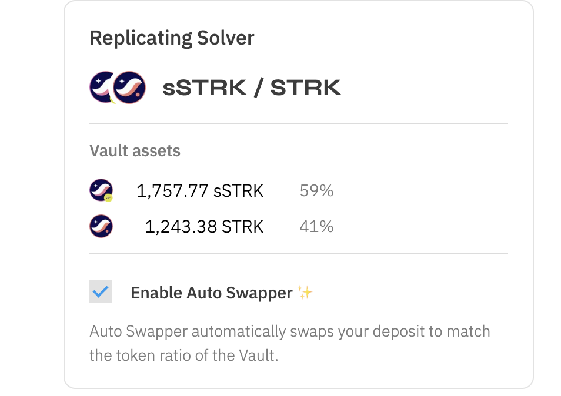

## What can you do with your sSTRK?

### 1. Provide Liquidity on Ekubo

Put your sSTRK to work in Ekubo’s liquidity pools, by providing liquidity to the sSTRK/STRK pool 👇
 https://app.ekubo.org/positions/0x534e5f4d41494e/0x02e0af29598b407c8716b17f6d2795eca1b471413fa03fb145a5e33722184067/888915

Enter the amount of sSTRK and STRK you’d like to add and click “Confirm” and follow the wallet prompts.

You will receive an NFT representing your position, where you can track earned rewards.

You get:

- Trading fees from all pool activity
- Extra DeFi Spring incentives
- Continue earning standard staking rewards
- Contribute to the ecosystem’s liquidity

### 2. Provide Liquidity on Nostra

Put your sSTRK to work in Nostra liquidity pools, by providing liquidity to the sSTRK/STRK pool 👇 

https://app.nostra.finance/pools/sSTRK-STRK/deposit

Enter the amount of sSTRK and click “Deposit liquidity” and follow the wallet prompts.

You will receive an [NOSTRA-sSTRK/STRK token,](https://starkscan.co/token/0x010dcf06e1fdc86c68d49a870ab895323e845100fc334b80c70d77c6b37cd6ec) representing your position. 

You get:

- Trading fees from all pool activity
- Extra DeFi Spring incentives
- Continue earning standard staking rewards
- Contribute to the ecosystem’s liquidity

### 3. Lending on Vesu

Generate additional yield by lending your sSTRK in Vesu’s lending market

➡️ https://vesu.xyz/lend

Stack multiple benefits:

- Earn lending APR
- Receive double Nimbora points
- Support Starknet’s lending markets

You can earn from staking, trading fees, lending, and protocol incentives, all while maintaining flexibility to switch between different strategies as market conditions change. This means you can stack multiple reward streams on top of your base staking position, optimizing your yields based on market opportunities.

### 4. Nostra Lending

Generate additional yield by lending your sSTRK on Nostra. 

➡️ https://app.nostra.finance/lend-borrow/sSTRK/deposit 

Stack multiple benefits:

- Earn lending APR
- Receive double Nimbora points
- Support Starknet’s lending markets

### 5. Opus

Deposit sSTRK on Opus to borrow $CASH. 

➡️ https://app.opus.money/troves/open

It lets you borrow against a portfolio of carefully curated collateral including yield-bearing assets. With minimal human intervention, the interest rates, maximum loan-to-value ratios and liquidation thresholds are dynamically determined by each user's collateral profile.

The asset you are borrowing is CASH, an algorithmic overcollateralized stablecoin soft pegged to the US dollar.

**How is CASH different from other stablecoins?**

Opus introduces novel mechanisms that provide stronger stability guarantees to ensure that CASH is pegged to the value of USD.

1. A global [multiplier](https://docs.opus.money/current/peg-stability#how-does-the-multiplier-work) is applied to increase or decrease interest rates across the board, depending on whether the spot market price of CASH is below or above peg.
2. A [forge fee](https://docs.opus.money/current/peg-stability#how-do-forge-fees-work) is charged on minting of new debt when the spot market price of CASH is below peg.

Learn more about Opus and CASH

➡️ https://docs.opus.money/current/ 

### 6. Haiko

Deposit to Haiko replicating solver.

➡️ https://app.haiko.xyz/vaults/positions?type=solver&address=0x73cc79b07a02fe5dcd714903d62f9f3081e15aeb34e3725f44e495ecd88a5a1&marketId=0xf2d72b2feb2998ebe9104f074be7bac04d378622f2d8344983a012106648d5&tab=deposit

 **What are Solvers?**

Solvers are a new, improved framework for building Haiko Vaults. They take the best parts of Strategies (i.e. convenience, 1-click automation) and make them simpler, more powerful, and less error-prone.

Solver Vaults introduce new features such as:

- **Zero cost rebalancing:** rebuilt from the ground up with a new architecture, Solvers are now stateless and can be rebalanced without any on-chain position updates, at zero gas cost to both swappers and LPs
- **Impermanent Loss caps**: pools can apply a hard cap on impermanent loss by rejecting swaps that bring the pool above its maximum allowed level portfolio skew

# **Security First**

At Nimbora, your security is our top priority. We're proud to announce two significant security partnerships:

### **✅ Zellic Security Audit**

Our smart contracts have been thoroughly audited by Zellic, a leading blockchain security firm trusted by major protocols in the industry. 
👉 [Get the audit here.](https://github.com/0xSpaceShard/nimbora-lst-public-audit/blob/main/Nimbora%20-%20Zellic%20Audit%20Report.pdf)

Their comprehensive audit ensures our contracts meet the highest security standards.

### **🛡️ Hypernative Integration**

We've partnered with Hypernative for proactive hack prevention:

🔹 Real-time threat detection and monitoring

🔹 Prevention of attacks before any damage occurs

🔹 Smart filtering to alert only on critical security concerns

### 🔄 Validator Architecture

Our validator architecture adopts a methodical approach to decentralization:

🔹 Multi-validator support Q1 2025 

🔹 Systematic expansion as the ecosystem grows

These measures demonstrate our commitment to building a secure and reliable protocol for our users. By combining thorough auditing, proactive security measures, and a methodical path to decentralization, we're creating multiple layers of protection for your assets.

## What’s next for sSTRK?

**What’s coming next on Nimbora** is going to be a second transformative step we’re going to make in the Starknet ecosystem journey! More information will be revealed very soon, so stay with us.

**Join our [Discord](http://discord.gg/nimbora) for alpha and early notifications 🚀**

# **About Nimbora**

Nimbora is a Starknet-based omnichain 1-click yield strategies platform that enables users to engage with Layer 1 protocols at a fraction of the cost. Discover the best of Ethereum protocols and optimize your DeFi strategies with Nimbora.

🐧🌐 [Website](https://www.nimbora.io/)

🐧👨‍💻 [DApp](https://app.nimbora.io/)

🐧🐦 [Twitter](https://twitter.com/Nimbora_)

🐧👋 [Discord](http://discord.gg/nimbora)

🐧💼 [LinkedIn](https://www.linkedin.com/company/nimbora/)

🐧📖 [Medium](https://medium.com/@Nimbora)

🐧🗞️ [Docs](https://docs.nimbora.io/)

🐧🛡 [Yield Dex Audit](https://github.com/0xSpaceShard/nimbora_audit_report_yield_dex/blob/main/Nimbora%20Audit%20Report.pdf)

🐧🛡 [LST Audit](https://github.com/0xSpaceShard/nimbora-lst-public-audit/blob/main/Nimbora%20-%20Zellic%20Audit%20Report.pdf)