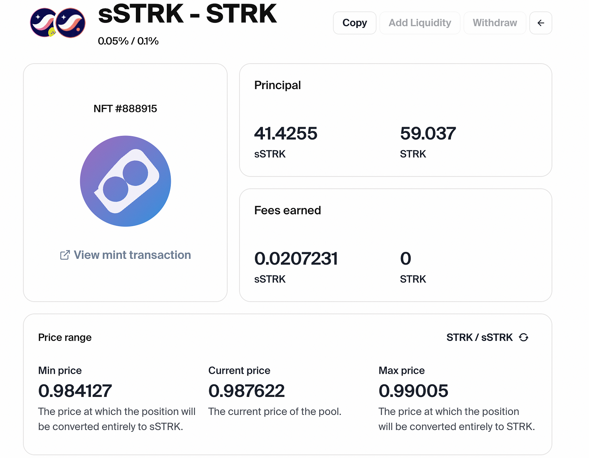
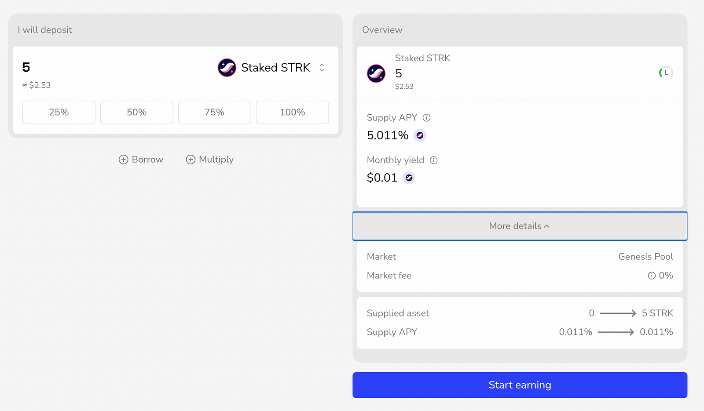

## What is sSTRK

sSTRK (staked STRK) is a liquid staking token (LST) representing STRK staked with Nimbora.

When you [stake your STRK tokens on Nimbora](https://app.nimbora.io/stake/), you receive sSTRK in return. The sSTRK token reflects your staked position on Nimbora and acts as a claim on your original STRK.

The beauty of all LST tokens lies in their **liquidity -** unlike traditional staking, where tokens are locked up, LST will enable users to keep their staked assets liquid and transferable. This means that you will be able to continue to participate in other DeFi activities while your STRK tokens are still earning rewards.

## Get Started

Visit [Nimbora dApp](https://app.nimbora.io/stake/) and connect your Starknet wallet ([Braavos](https://braavos.app/) or [ArgentX](https://argent.xyz/)).

Enter the amount of STRK you want to deposit, or click on the small buttons below the box (25%, 50%, 75%, 100%) to set a desired percentage of the balance you want to deposit.

When you've selected the token amount to deposit, click on "deposit" and follow the prompts on your wallet ([Braavos](https://braavos.app/) or [ArgentX](https://argent.xyz/)) to complete the transaction.

Once the transaction has been accepted on the network, a popup will appear at the bottom right of the screen to let you know.

And that's it, you should be able to see your balance of sSTRK into the [Nimbora portfolio section.](https://app.nimbora.io/portfolio/)

## What can you do with your sSTRK?

### 1. Provide Liquidity on Ekubo

Put your sSTRK to work in Ekubo’s liquidity pools, by providing liquidity to the sSTRK/STRK pool 👇
 https://app.ekubo.org/positions/0x534e5f4d41494e/0x02e0af29598b407c8716b17f6d2795eca1b471413fa03fb145a5e33722184067/888915

Enter the amount of sSTRK and STRK you’d like to add and click “Confirm” and follow the wallet prompts.

You will receive an NFT representing your position, where you can track earned rewards.

You get:

- Trading fees from all pool activity
- Extra DeFi Spring incentives
- 2x Nimbora tokens for being a liquidity provider
- Continue earning standard staking rewards
- Contribute to the ecosystem’s liquidity

### 2. Lending on Vesu

Generate additional yield by lending your sSTRK in Vesu’s lending market

➡️ https://vesu.xyz/lend

Stack multiple benefits:

- Earn lending APR
- Receive double Nimbora points
- Support Starknet’s lending markets

You can earn from staking, trading fees, lending, and protocol incentives, all while maintaining flexibility to switch between different strategies as market conditions change. This means you can stack multiple reward streams on top of your base staking position, optimizing your yields based on market opportunities.

## How to unstake

You can choose between two options - Instant and Normal.

Instant mode factors in the price impact and set slippage.

Normal unstake duration is 21 days.

Once you have selected the prefered method, you will need to decide on the amount you want to withdraw.  This could be all or a portion of your assets.

Click on the 'unstake' button and follow the prompts on your wallet ([Braavos](https://braavos.app/) or [ArgentX](https://argent.xyz/)) to complete the transaction.

Once the transaction has been accepted on the network, a popup will appear at the bottom right of the screen to let you know.

You can consult all of your recent transactions in the wallet section. Your transaction should be here.

 

And that's it, you should see your pending request in the navbar.

Nimbora takes over the task of processing this request. This involves preparing your assets in order to be transferred back to your wallet, a process that is handled entirely behind the scenes to ensure a smooth and efficient operation. Once the request is ready to be claimed, Nimbora relayer will handle it and send it directly into your wallet.

# **Security First**

At Nimbora, your security is our top priority. We're proud to announce two significant security partnerships:

### **✅ Zellic Security Audit**

Our smart contracts have been thoroughly audited by Zellic, a leading blockchain security firm trusted by major protocols in the industry. Their comprehensive audit ensures our contracts meet the highest security standards.

### **🛡️ Hypernative Integration**

We've partnered with Hypernative for proactive hack prevention:

🔹 Real-time threat detection and monitoring

🔹 Prevention of attacks before any damage occurs

🔹 Smart filtering to alert only on critical security concerns

### 🔄 Validator Architecture

Our validator architecture adopts a methodical approach to decentralization:

🔹 Multi-validator support Q1 2025 

🔹 Systematic expansion as the ecosystem grows

These measures demonstrate our commitment to building a secure and reliable protocol for our users. By combining thorough auditing, proactive security measures, and a methodical path to decentralization, we're creating multiple layers of protection for your assets.

## What’s next for sSTRK?

**What’s coming next on Nimbora** is going to be a second transformative step we’re going to make in the Starknet ecosystem journey! More information will be revealed very soon, so stay with us.

**Join our [Discord](http://discord.gg/nimbora) for alpha and early notifications 🚀**

# **About Nimbora**

Nimbora is a Starknet-based omnichain 1-click yield strategies platform that enables users to engage with Layer 1 protocols at a fraction of the cost. Discover the best of Ethereum protocols and optimize your DeFi strategies with Nimbora.

🐧🌐 [Website](https://www.nimbora.io/)

🐧👨‍💻 [DApp](https://app.nimbora.io/)

🐧🐦 [Twitter](https://twitter.com/Nimbora_)

🐧👋 [Discord](http://discord.gg/nimbora)

🐧💼 [LinkedIn](https://www.linkedin.com/company/nimbora/)

🐧📖 [Medium](https://medium.com/@Nimbora)

🐧🗞️ [Docs](https://docs.nimbora.io/)

🐧🛡 [Audit](https://github.com/0xSpaceShard/nimbora_audit_report_yield_dex/blob/main/Nimbora%20Audit%20Report.pdf)